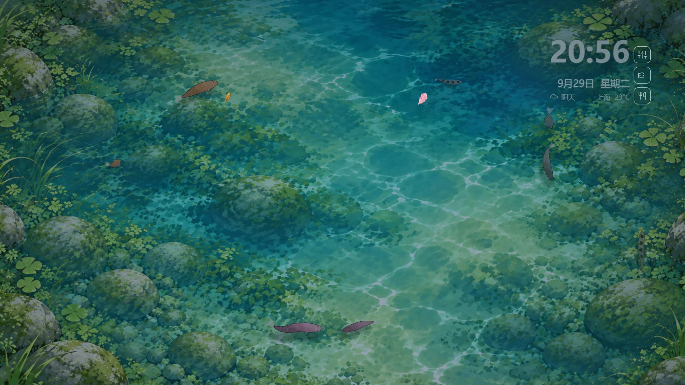
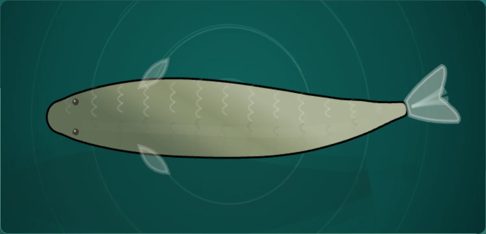
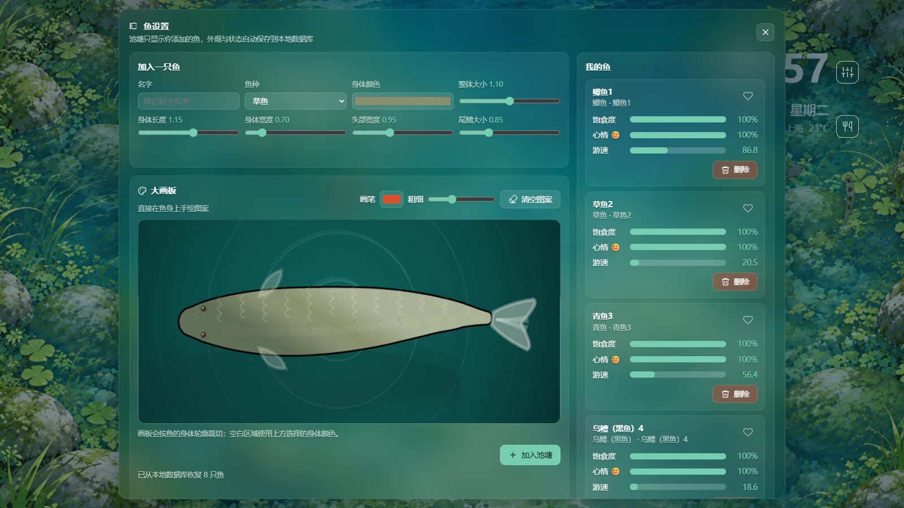
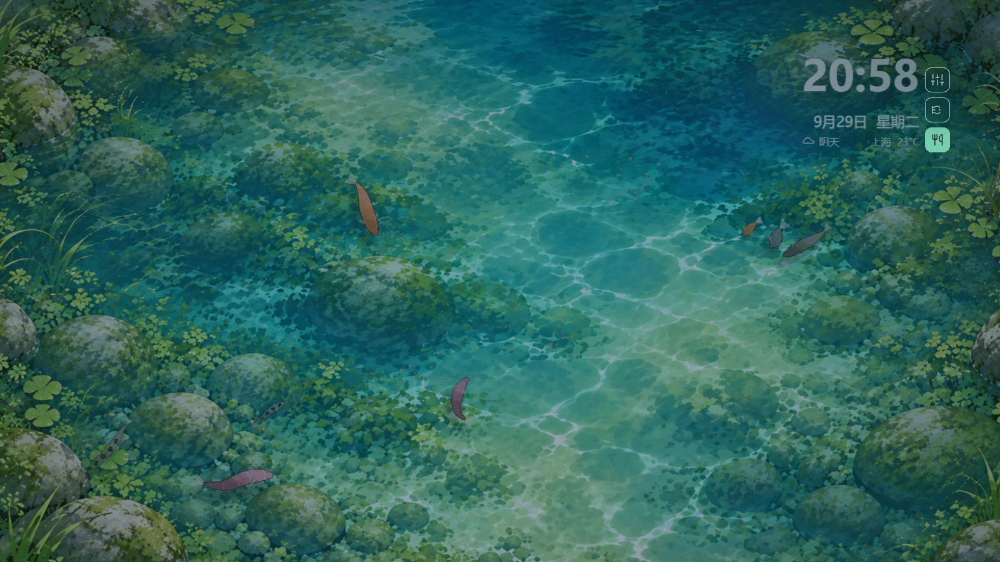
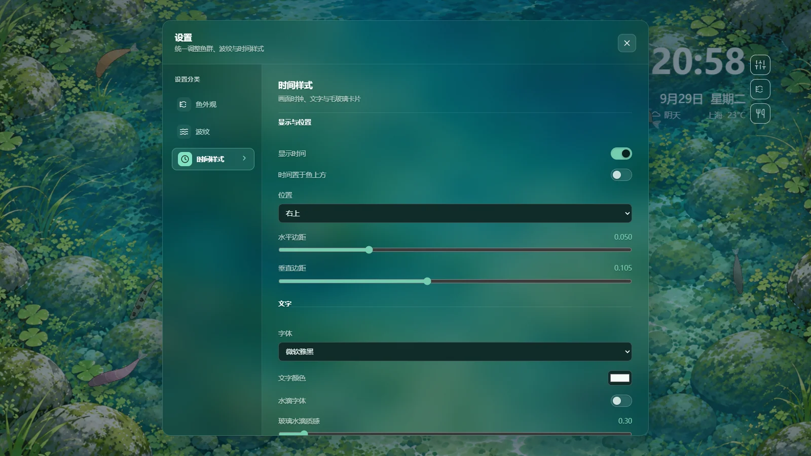
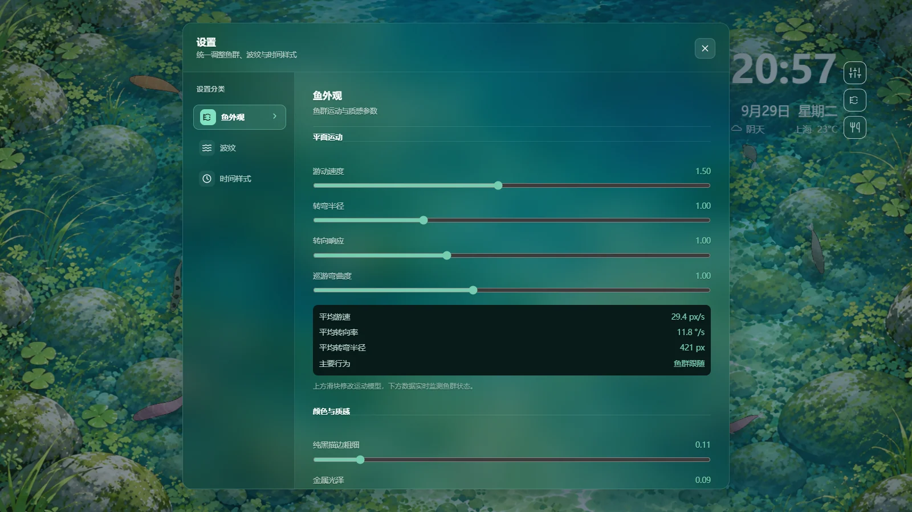
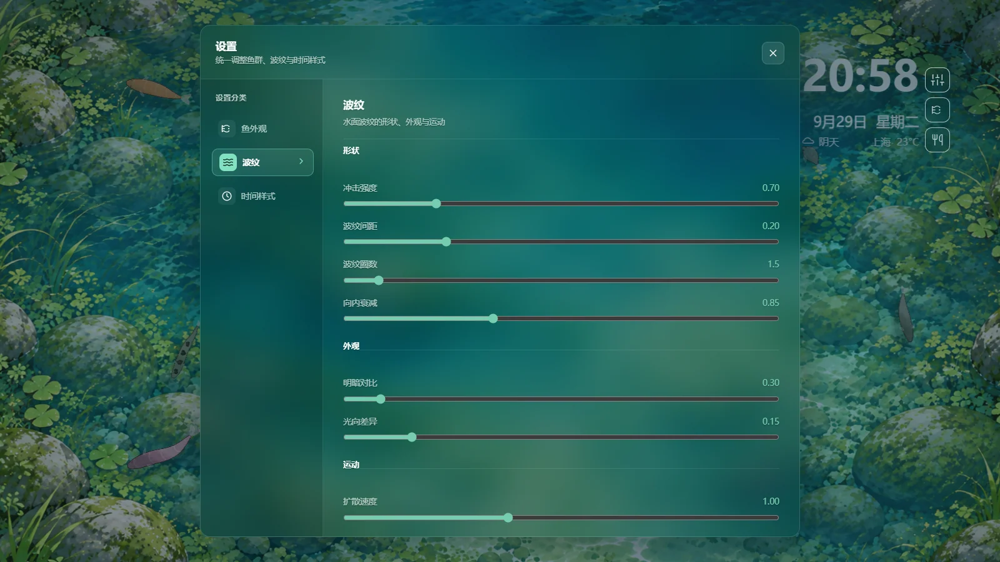
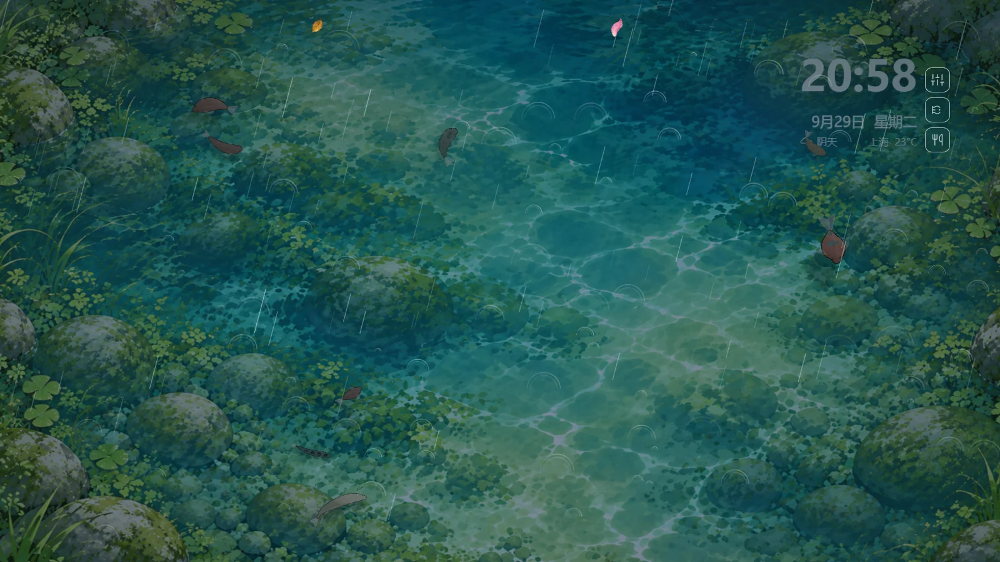

# 中国淡水鱼塘 · 独立网页版壁纸

一塘会自己活起来的水：真实感的水面焦散、随时间走的光、十种中国淡水鱼在里面群游。你可以在旁边喂它、给它画花纹、给它起名字。

纯前端实现（Canvas 2D + WebGL），**双击 `index.html` 就能跑** —— 不需要 Wallpaper Engine，不需要 Lively，不需要本地服务器，也不需要任何构建工具链。

当前版本：**1.0.3** ｜ 许可证：Apache-2.0



## 项目简介

这是一个从 Wallpaper Engine 壁纸项目中剥离出来的独立网页版。整个池塘就是一块全屏 canvas：水面用 WebGL 着色器计算焦散与波纹，鱼用 Canvas 2D 逐条绘制，鱼群有自己的群游、躲避、觅食与碰撞。

它没有运行时依赖，源码按职责拆成模块（`src/`），由 `build-standalone.cjs` 打包成一个可以直接用 `<script>` 引入的 `app.bundle.js`。可以当壁纸挂在桌面上，也可以直接当网页打开欣赏；`src/` 的分层结构适合继续往里加鱼种和玩法。

## 功能特性

### 水面与光

- **WebGL 水面**：实时焦散、水面波纹与高光；涟漪会随点击、鱼群游动和雨水持续扩散。
- **光随时间走**：画面光向与明暗跟着现实时间变化 —— 时钟写着 22:00，水面就真的是夜里的样子。
- **天气与环境**：晴天、阴天、雨天三套预设（雨天有雨丝与雨滴涟漪），并影响水色与光感。

### 中国淡水鱼

- **10 种常见淡水鱼**：草鱼、鲫鱼、鲤鱼、鲢鱼、鳙鱼、青鱼、鳜鱼、乌鳢（黑鱼）、黄颡鱼、武昌鱼，各自有体型比例、颜色、鳞片与斑纹特征，另有十种混合模式。
- **逐条渲染的鱼身**：分节身体、动态摆尾、鳞片、金属光泽与纯黑描边，按体型自动省略看不见的细节。
- **鱼群行为**：群游、跟随、巡游、转弯、躲避与互相碰撞；投喂时会主动追过来抢食。



### 鱼设置：养自己的鱼



- 选择鱼种、起名字，调整身体颜色与体型（长度、宽度、头部、尾鳍、整体大小）。
- **手绘鱼身图案**：画板以真实鱼渲染器为底，直接在鱼身上涂画，笔刷可选颜色和粗细，一键清空。
- **我的鱼列表**：显示鱼种、名字、饱食度、心情与游速，可收藏、可删除。
- 首次打开且数据库为空时，自动生成 8 条随机鱼（鱼种、纹理、大小、颜色随机）。
- 外观与状态保存在浏览器本地数据库（IndexedDB，不支持时回退 localStorage），下次打开原样恢复。

### 互动与陪伴



- **投喂模式**：点一下水面就撒一把饵料，饵料缓缓下沉，鱼群会从远处赶过来抢食。
- **惊扰反馈**：鼠标划过或点击，鱼群受惊散开，水面泛起同心波纹。
- **自持事件**：无人操作时，落叶与花瓣会漂过水面，偶尔把鱼吸引成群。

### 时钟卡片与实时天气



- 时钟显示时间、日期和**实时天气**（天气状态、地区名称、摄氏温度），数据来自 Open-Meteo，每 30 分钟刷新，地区默认按浏览器时区推断。
- 位置（四角）、水平与垂直边距、字体、文字颜色、透明度均可调，支持水滴字体与毛玻璃卡片。
- 内置荷叶雾、月光水、暖玉、莲粉、深潭、夜蓝 6 套配色，并可切换时间显示在鱼的前层或后层。

### 统一设置面板



- 画面上的紧凑入口按钮对应三个面板：**设置**、**投喂模式**、**鱼设置**。
- 设置面板把「鱼外观」「波纹」「时间样式」收进同一个分类导航，参数实时生效并自动保存，重新打开页面时恢复上次的调法。
- 鱼外观页带实时数据：平均游速、平均转向率、平均转弯半径与当前主要行为。

波纹页可调间距、圈数、扩散速度、亮度、宽度与衰减等参数：



### 雨天



## 快速开始

1. 下载或克隆本仓库。
2. 双击 `index.html`（Chrome / Edge 等现代浏览器）。

想用本地服务器也可以，比如需要固定 URL 或做调试时：

```bash
python -m http.server 8000
# 然后打开 http://127.0.0.1:8000/index.html
```

## 开发

源码在 `src/` 下，按 ESM 模块拆分；`app.bundle.js` 是构建产物，**不要手工修改**。

```bash
# 打包 src/ → app.bundle.js
node build-standalone.cjs

# 运行测试（Node 内置测试能力，无需安装依赖）
node tests/storage-and-input.test.cjs
node tests/live-weather.test.cjs
```

Windows 下双击 `构建并预览.cmd` 可以一步完成「打包 + 打开页面」。

### 调试参数

| 参数 | 作用 |
| --- | --- |
| `index.html?debug=1` | 暴露 `window.__pondDebug`，可在控制台检查鱼群、环境与各系统状态 |
| `index.html?weather=rain` | 切到雨天（可选 `rain`、`clear`），用于预览天气表现 |
| `index.html?weatherCity=杭州` | 指定时钟卡片显示的地区 |

### 目录结构

```
.
├─ index.html              入口页面
├─ app.bundle.js           由 src/ 打包生成（自动生成，勿手改）
├─ style.css               页面与 UI 样式
├─ theme.js                主题、天气预设、光向
├─ koishape.js             鱼身轮廓数学
├─ watergl.js              WebGL 水面焦散与波纹
├─ src/
│  ├─ app.js               组合根：装配全部系统
│  ├─ builtins.js          内置生物与玩法清单
│  ├─ core/                帧循环、图层、环境、设置、功能注册表
│  ├─ pond/                鱼种、群游、行为、碰撞、食物、种群
│  ├─ render/              渲染器、鱼身、焦散、涟漪、雨丝、背景
│  ├─ features/            时钟、投喂、鱼管理、天气、落叶花瓣、时段光
│  ├─ ui/                  设置面板 + 鱼外观 / 波纹 / 时间样式三个参数页
│  ├─ input/               输入路由与浏览器输入适配
│  └─ storage/             本地数据库（IndexedDB / localStorage）
├─ tests/                  Node 测试
├─ assets/                 背景、水面、荷叶花瓣等素材
├─ docs/images/            README 截图
├─ DESIGN.md               UI 设计规范（新增界面沿用同一套视觉语言）
└─ CHANGELOG.md            更新日志
```

## 版本

- 当前版本：**1.0.3**
- 更新日志：见 [CHANGELOG.md](CHANGELOG.md)

## 许可与致谢

本项目以 [Apache License 2.0](LICENSE) 发布。界面图标使用 Lucide Icons 的路径，授权信息见 [THIRD_PARTY_NOTICES.md](THIRD_PARTY_NOTICES.md)；时钟天气数据来自 [Open-Meteo](https://open-meteo.com/)。
